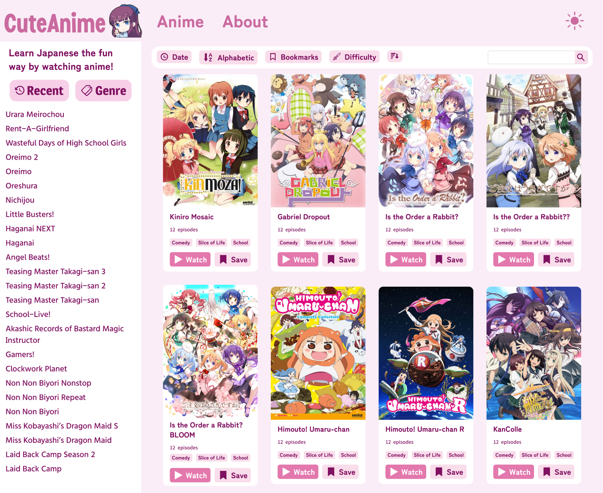
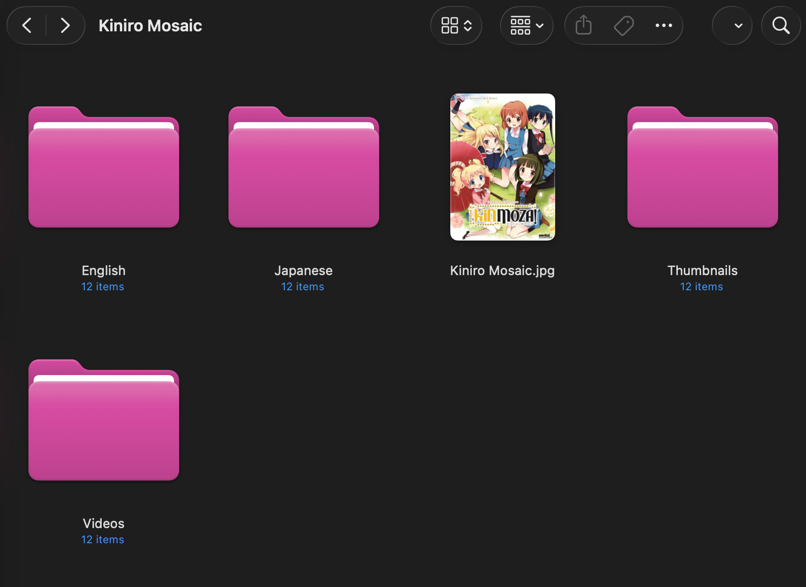

# CuteAnime



CuteAnime is a web interface to study Japanese in a funner way by watching your favorite anime. 

You are responsible for filling it with your own content (cover, videos, thumbnails, english subtitles, japanese subtitles, and show info). 

CuteAnime contains tools to make your learning experience easier, such as a full subtitle transcript that makes it easy to jump between the previous and next dialogue. 

It's intended to be used with Japanese subtitles, but you can also provide English subtitles to quickly reference the translation. It's best not to rely on them too much. 

You can also control the speed of videos to slow them down if the speaking rate is too fast.

### Shortcuts

- Space: Play/Pause
- Left Arrow: Previous Dialogue
- Right Arrow: Next Dialogue
- Up Arrow: Increase Volume
- Down Arrow: Decrease Volume

### Design

Our design is available here: https://www.figma.com/design/1TVVBOp3xpd7hN34hLl4tB/CuteAnime

*New design is wip

### Effective Learning

To make effective use of this resource, you should at least know Hiragana, Katakana, and basic grammar. Otherwise it is going to be too hard since anime characters speak pretty fast. 

I recommend reading manga first, since you can read at your own pace. 

You should use [Anki](https://apps.ankiweb.net/) with the AnkiConnect extension and [Yomitan](https://yomitan.wiki/). In your Yomitan settings, enable the Anki integration so that you can add any words you don't know yet into an Anki deck for studying. 

Writing down the Kanji will make it easier to memorize them. You can use any note-taking app for this, but I use [Notability](https://notability.com/) on the ipad.

### Installation

First install Node.js if you don't have it already. 

https://nodejs.org/en/

The whole "database" is stored in the `database.js` and `episodes.js` files instead of using a 
real database for easy editing.

You can look at `database.example.js` and `episodes.example.js` to see the structure of the database.

Clone the code from this repository and then install dependencies with `npm install`. 

Start the web server with `npm start`. 

Finally edit the pathname for the route `/Anime/*` in `server.ts` to the location of the anime folder on your local hard drive.

### File Structure

The interface expects the following filesystem structure:

```
Anime
├── Anime Name 1
│   ├── English (VTT subtitles)
│   ├── Japanese (VTT subtitles)
│   ├── Thumbnails (JPG thumbnails)
│   ├── Videos (MP4 videos)
│   └── cover.jpg
├── Anime Name 2
│   ├── English (VTT subtitles)
│   ├── Japanese (VTT subtitles)
│   ├── Thumbnails (JPG thumbnails)
│   ├── Videos (MP4 videos)
│   └── cover.jpg
└── etc.
```



The name of every file in the folders should be "Anime Name (episode number)". 

A good resource to find Japanese subtitles for lots of anime is [Kitsunekko](https://kitsunekko.net/dirlist.php?dir=subtitles%2Fjapanese%2F). 

Subtitles are only accepted in VTT format, and must be converted from ASS/SRT. You can use the "VTT" button in my application to convert subtitles: [Pixel Compressor](https://github.com/Moebytes/Pixel-Compressor).

You need to make sure the Japanese and English subtitles are timed to the video correctly. Some tools that could help with this:

- [Alass](https://github.com/kaegi/alass)
- [Subtitle Sync Shifter](https://subtitletools.com/subtitle-sync-shifter)

If you want to add more metadata to make the site look nicer, you can fill out the rest of the keys in `database.js` and episode synopsis in `episodes.js`.

### Manga Version
- [CuteManga](https://github.com/Moebytes/Cutemanga)
